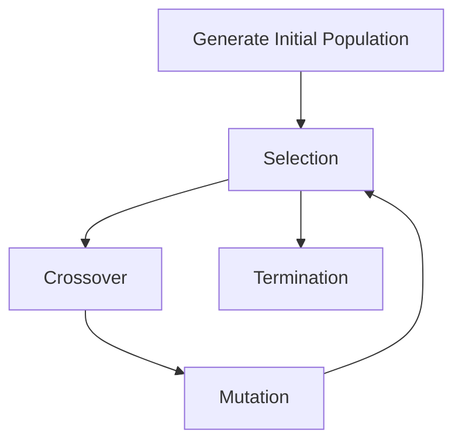
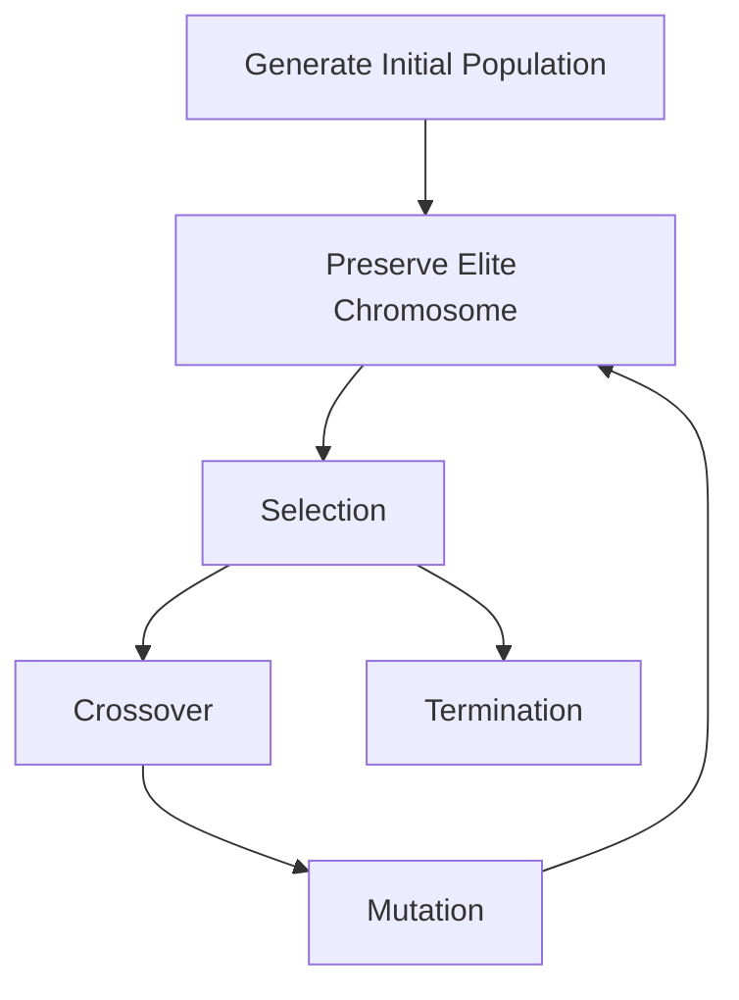

### Outline 
1. Randomly Initialize Population
2. Chromosome repairing (Prevent chromosome from violating constraints)
3. Parent Selection
4. Crossover to produce offsprings
5. Mutation
6. Repeat

### Note 
- Element in =="Population"== is Called =="Chromosome"==
- Each Chromosome has element(s) called =="Gene"==

### Denotation
- ==Population== _denotes sets of possible candidate solutions_
- ==Chromosome== _denotes a particular solution_
- ==Gene== _denotes a particular element in chromosome_
- ==Fitness== _evaluates how close a given solution is to the optimum solution of the desired_ problem

### Procedure
![[Pasted image 20231219091650.png]]

### Chromosome (Parent) Selection 
##### *ConcepGt*
Maintain only good parents(best fitness) to create offspring for next generation
##### *Method*
- ==Roulette Wheel Selection (Fitness proportionate selection) one fixed-point==
- Stochastic Universal Sampling (SUS) multi fixed-point

### Crossover
##### *Concept*
Create new offspring by recombine chromosome of selected parents
##### *Method*
- ==One-point Crossover==
- Multi-point Crossover
- Uniform/Segment Crossover

### Mutation
##### *Concept*
randomly changes chromosome of individual to maintain diversity and explore new region of solution space
##### *Method*
- ==Random Resetting==
- Swap Mutation
- Scramble Mutation
### Example
#### ==Solve 2a+4b+3c-2d=41==
##### *Objective Function*
$$
g(a, b, c, d) = abs(2a+4b+3c-2d-41)
$$
##### *Fitness Function*
$$ fitness[i] = \dfrac1 {1 + g(a, b, c, d)} $$

# Genetic Algorithm for job assignment problem
### Problem State
$$
cost\;matrix : 
\begin{pmatrix}
9&2&7&8\\
6&4&3&7\\
5&8&1&8\\
7&6&9&4
\end{pmatrix}
$$
##### *Objective Function*
$$
Minimize : \sum_{i \text{ in W}}^n \sum_{j \text{ in J}}^m (C_{ij} \cdot x_{ij})
$$

### Denotation
- =="Population"== is a sets of possible solutions
- =="Chromosome"== is a candidate solution which is a mix or a combination of each worker job assignment
- =="Gene"== represents a path or a job that assigned to a worker [1, 0, 2, 3] worker 0 -> job 1, worker 1 -> job 0, and so on..

### Crossover Method
- PMX Crossover (Partially Mapped Crossover) -> prevent duplication of gene in the same chromosome
	1. Extract some part of parent chromosome
	2. Swap gene in the crossover point region
	3. Fill the remaining space in chromosome
![[Pasted image 20231225165111.png]]
### Mutation Method
- Randomly swap genes

# Genetic Algorithm for Prosecutor Relocation Optimization

### Chromosome Repairing Process
- Prevent a chromosome from violating constraints e.g. capacity constraints

### Important Operation is to ==KEEP ELITISM==
read https://www.baeldung.com/cs/elitism-in-evolutionary-algorithms
tuning is needed by
![[Pasted image 20240110101422.png]]
### Procedure

### Result
![[Pasted image 20240109171125.png]]
![[Pasted image 20240109171337.png]]

### Performance Test
![[Pasted image 20240205182414.png]]
Parameter : PREF. = 10, CSRO = 0.45, MUT = 0.4, ELT = 0.2, GEN. = 500, POP. = 20
![[Pasted image 20240205182040.png]]
Parameter : PREF.  = 30, CSRO = 0.45, MUT = 0.4, ELT = 0.2, GEN. = 500, POP. = 20
![[Pasted image 20240206112757.png]]

#### Expected 
- O(N) Time Complexity
### Issues
- Using copy.deepcopy taking too much time ti execute instead use the list comprehension and create new object is a lot faster