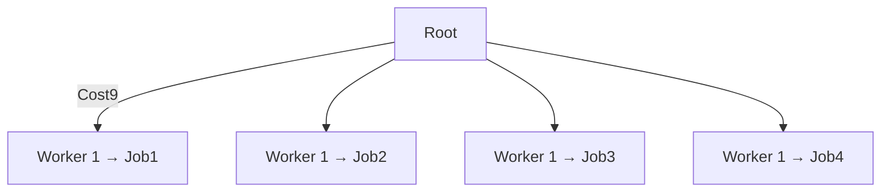

Cost Matrix
$$\begin{pmatrix}
C_{11} & C_{12} & C_{13} & ... & C_{1m} \\
C_{21} & C_{22} & C_{23} & ... & C_{2m} \\
C_{31} & C_{32} & C_{33} & ... & C_{3m} \\
... & ... & ... & ... & ... \\
C_{n1} & C_{n2} & C_{n3} & ... & C_{nm} \\
\end{pmatrix}$$
Example
$$\begin{pmatrix}
9&2&7&8\\
6&4&3&7\\
5&8&1&8\\
7&6&9&4
\end{pmatrix}$$
Tree-like Structure

